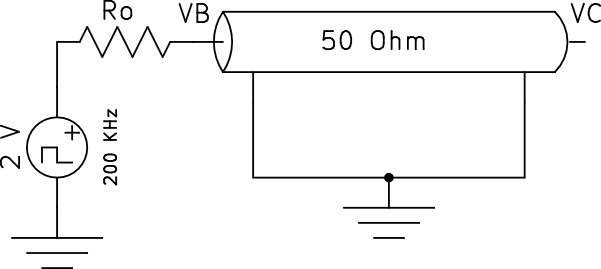
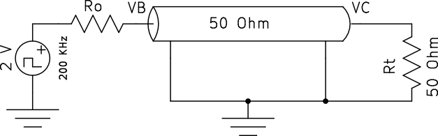
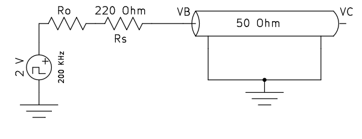

### RELAZIONE DI LABORATORIO – ELETTRONICA
### ESERCITAZIONE 3 – INTERCONNESIONI E LINEE DI TRASMISSIONE 
**(Giovedì 7 Novembre 2013)**

SQUADRA A06  – LED 9

Nome:		 BONATO Alessio		____________________________

Matricola:		180472

Nome:		 DI BIASE Armonia	____________________________

Matricola:		181325

Nome: 		 MANINO Marco		____________________________

Matricola:		180678

Nome:	  	 MANTOVANI Alessia	____________________________

Matricola:		180812

Elenco dei dispositivi:
	
- Oscilloscopio Digitale Agilent DSO3102A  (Figura 1)
- Cavi coassiali (BNC-BNC)
- Cavi coassiali (BNC-banana)
- Cavi banana-banana
- Matassa di cavi coassiali (circa 20 metri)
- Sonde compensate Agilent N2862A
- Resistenze
- Condensatori
- Piastra per montaggi sperimentale 
- Generatore di funzioni Agilent 33220A (Figura 3)
- Circuiti logici di varie famiglie

~ **Scopo dell'esercitazione**

~ **Cenni teorici**

~ **DIARIO DELL'ESPERIENZA**

*A) MISURA DEI PARAMETRI DEL GENERATORE:*

Come prima cosa abbiamo impostato il generatore di segnali in modo che producesse un'onda quadra di ampiezza 2 V, frequenza 200 kHz e duty-cycle del 50% ed abbiamo verificato l'uscita a vuoto con il multimetro; la misura risultante è stata Val = 3,961 V, come ci aspettavamo è quasi il doppio di quello richiesto, in quanto il generatore di segnali si aspettava un dispositivo con bassa impedenza di ingresso (50 Ohm) ed era di conseguenza regolato.

Dopochè con il multimetro abbiamo misurato la resistenza interna del generatore, attaccando una resistenza da 100 Ohm in serie al generatore e misurando il voltaggio su di essa; il valore ottenuto è stato Vb = 2,73 V che abbiamo utilizzato per calcolare R0.

(formula 1)    R0 = Rl(Val-Vb)/Vb = 44,514 Ohm

*B) MISURA DEI PARAMETRI DEL CAVO:*

Seguendo le istruzioni del professore, abbiamo tentato di calcolare la lunghezza della matassa tramite la misura del ritardo di un pezzo di cavo coassiale preso a campione (molto più corto, circa 1 metro); questo ci ha occupato per un po' di tempo, senza purtroppo dare risultati a causa, probabilmente, della risoluzione troppo bassa dello strumento oppure della ridotta lunghezza del cavo. 

Abbiamo quindi optato per un'altra soluzione (seppure meno accurata, ma suggerita dall'assistente di laboratorio), calcolando la lunghezza della matassa data, contando il numero di spire (27) e misurando approssimativamente il diametro (22 cm circa); il risultato ottenuto è stato circa 18,9 metri.
Successivamente abbiamo collegato questa matassa al generatore di onda quadra ed abbiamo verificato il diagramma a traliccio. 

(foto 1) 

(circuito 1): 

Il tempo in cui Vb si stabilizza è pari al quello in cui l'onda percorre due volte il filo (onda riflessa), ovvero circa 160 ns, da quì la velocità di propagazione è risulta essere: 

(formula 2)    U = l/t = 0,78 c

Coerentemente al valore dato: 0,7 c.

Collegando una resistenza di circa 50 Ohm (49,8 Ohm), ottenuta mettendo due resistenze da 100 Ohm in parallelo  abbiamo verificato l'assenza di riflessioni.

(foto 3) 

(circuito 2): 

*C) EFFETTI DEL DISADATTAMENTO LATO GENERATORE E LATO REMOTO:*

Per svolgere le richieste abbiamo collegato in serie al generatore una resistenza Rs = 220 Ohm e lasciato l'altro capo aperto.
Abbiamo quindi calcolato il valore atteso dell'indice di riflessione 

(formula 3) Teta_g = (R0+Rs-Z0)/(R0+Rs+Z0) = 0,68 circa 

(circuito 3): 

(grafico 1)

Il valore ricavato risultava essere 0,62, calcolato dopo aver appreso dall'oscilloscopio il valore in B iniziale e il valore in B dopo 2 tempi di propagazione e tenendo conto della riflessione totale dal lato remoto abbiamo usato la formula:

(formula 3)   Teta_g = (Vb2/Vb0)-2 = 0,62

*D) EFFETTI DEL CARICO CAPACITIVO:*

*E) RIFLETTOMETRIA NEL DOMINIO DEL TEMPO:*

*F) LINEA PILOTATA DA CIRCUITI LOGICI:*

