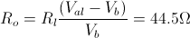
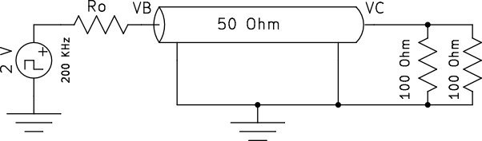
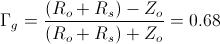
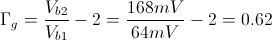
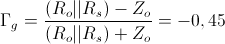
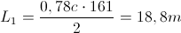
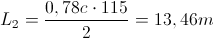

### RELAZIONE DI LABORATORIO – ELETTRONICA
#### ESERCITAZIONE 3 – INTERCONNESIONI E LINEE DI TRASMISSIONE 
**(Giovedì 7 Novembre 2013)**

SQUADRA A06  – LED 9

o **Elenco dei dispositivi:**
	
- Oscilloscopio Digitale Agilent DSO3102A  (Figura 1)
- Cavi coassiali (BNC-BNC)
- Cavi coassiali (BNC-banana)
- Cavi banana-banana
- Matassa di cavi coassiali (circa 20 metri)
- Sonde compensate Agilent N2862A
- Resistenze
- Condensatori
- Piastra per montaggi sperimentale 
- Generatore di funzioni Agilent 33220A (Figura 3)
- Circuiti logici di varie famiglie

o **Scopo dell'esercitazione:**

- A) misura dei parametri del generatore
- B) misura dei parametri del cavo
- C) effetti del disadattamento lato generatore e lato remoto
- D) effetti del carico capacitivo
- E) riflettometria nel dominio del tempo
- F) linea pilotata da circuiti logici

o **Cenni teorici**  

Il cavo coassiale è un esempio di linea di trasmissione senza perdite utilizzato per trasferire segnali elettrici. In particolare viene utilizzato in tutte le applicazioni in cui un segnale in alta frequenza deve essere connesso da un punto di una rete ad un altro. In questo caso la lunghezza del filo non è più trascurabile, parleremo dunque di parametri distribuiti.
                                                                                                                                                 I parametri che caratterizzano una linea di trasmissione sono infatti un’impedenza caratteristica ed una velocità di propagazione, i quali dipendono dall’induttanza e dalla capacità, che a loro volta sono funzione delle caratteristiche fisiche quali le dimensioni e il dielettrico. Infine, come ulteriore parametro, vi è il tempo di propagazione, dato dal rapporto tra la lunghezza del cavo e la velocità di propagazione all’interno di esso: identifica quindi il tempo impiegato dal segnale elettrico per spostarsi sul conduttore.                                                                                                           Per pilotare la linea di può andare ad applicare un gradino: si genererà quindi un’onda progressiva dal generatore verso il carico e, qualora siano presenti discontinuità del condensatore o carichi, le variazioni di tensioni e corrente generano anche un’onda riflessa, che si propaga nel verso opposto dell’onda incidente. La frazione di segnale incidente che viene riflessa in verso opposto dalla terminazione della linea è detto coefficiente di riflessione ed indicato con la lettera Γ. Per evitare questo tipo di riflessioni si lavora in condizione di adattamento, ovvero la linea viene chiusa sulla propria impedenza caratteristica: in questo modo, ai fini della propagazione, non si ha alcuna discontinuità ed è come se il segnale continuasse a propagarsi oltre la terminazione. La tensione totale sulla linea sarà quindi data dalla somma, punto per punto, dell’onda incidente e di quella riflessa.                                                                                                             Nei casi reali, sulla linea sono connessi almeno un driver, alcuni ricevitori ed in genere una terminazione. I ricevitori vanno ad introdurre un carico che porta ad un disadattamento rispetto all’impedenza caratteristica, il che causa ulteriori riflessioni. Dunque, al fine di evitare di abbassare eccessivamente l’impedenza caratteristica, occorre limitare il numero di elementi collegati alla linea.

Si definisce, infine, diafonia il mutuo accoppiamento induttivo, capacitivo e resistivo che determina un  trasferimento di segnali dalle linee attive a quelle a riposo: ciò può causare errori nel trasferimento delle informazioni. Questo effetto può essere ridotto distanziando i conduttori o schermandoli.

o **DIARIO DELL'ESPERIENZA**

- *A) MISURA DEI PARAMETRI DEL GENERATORE:*

Come prima cosa abbiamo impostato il generatore di segnali in modo che producesse un'onda quadra di ampiezza 2 V, frequenza 200 kHz e duty-cycle del 50% ed abbiamo verificato l'uscita a vuoto con il multimetro; la misura risultante è stata Val = 3,961 V, come ci aspettavamo è quasi il doppio di quello richiesto, in quanto il generatore di segnali si aspettava un dispositivo con bassa impedenza di ingresso (50 Ohm) ed era di conseguenza regolato.

Dopochè con il multimetro abbiamo misurato la resistenza interna del generatore, attaccando una resistenza da 100 Ohm in serie al generatore e misurando il voltaggio su di essa; il valore ottenuto è stato Vb = 2,73 V che abbiamo utilizzato per calcolare R0.

- *B) MISURA DEI PARAMETRI DEL CAVO:*

Seguendo le istruzioni del professore, abbiamo tentato di calcolare la lunghezza della matassa tramite la misura del ritardo di un pezzo di cavo coassiale preso a campione (molto più corto, circa 1 metro); questo ci ha occupato per un po' di tempo, senza purtroppo dare risultati a causa, probabilmente, della risoluzione troppo bassa dello strumento oppure della ridotta lunghezza del cavo. 

Abbiamo quindi optato per un'altra soluzione (seppure meno accurata, ma suggerita dall'assistente di laboratorio), calcolando la lunghezza della matassa data, contando il numero di spire (27) e misurando approssimativamente il diametro (22 cm circa); il risultato ottenuto è stato circa 18,9 metri.
Successivamente abbiamo collegato questa matassa al generatore di onda quadra ed abbiamo verificato il diagramma a traliccio. 

(foto 1) 

(circuito 1): 

Il tempo in cui Vb si stabilizza è pari al quello in cui l'onda percorre due volte il filo (onda riflessa), ovvero circa 160 ns, da quì la velocità di propagazione è risultata essere: 

Coerentemente al valore dato: 0,7 c.

Collegando una resistenza di circa 50 Ohm (49,8 Ohm), ottenuta mettendo due resistenze da 100 Ohm in parallelo  abbiamo verificato l'assenza di riflessioni.

(foto 3) 

(circuito 2): 

- *C) EFFETTI DEL DISADATTAMENTO LATO GENERATORE E LATO REMOTO:*

Per svolgere le richieste abbiamo collegato in serie al generatore una resistenza Rs = 220 Ohm e lasciato l'altro capo aperto.
Abbiamo quindi calcolato il valore atteso dell'indice di riflessione 

(circuito 3): 

(grafico 1)

Il valore ricavato risultava essere 0,62, calcolato dopo aver appreso dall'oscilloscopio il valore in B iniziale e il valore in B dopo 2 tempi di propagazione e tenendo conto della riflessione totale dal lato remoto abbiamo usato la formula:

Dopodichè abbiamo ripetuto la misura montando una resistenza da circa 33 Ohm (costruita con tre resistenze da 100 Ohm in parallelo). Questo ci ha permesso di verificare il fenomeno richiesto dall'esperienza anche se quest'ultima richiedeva una resistenza da 22 Ohm, in quanto, come ci hanno fatto notare gli assistenti di laboratorio, l'importante era avere un indice di riflessione negativo ed è quello che abbiamo verificato anche se con la resistenza diversa da quella data.

(circuito 4)

Con il multimetro abbiamo verificato l'effettivo valore delle tre resistenze in parallelo (circa 33,17 Ohm) e quindi calcolato l'indice di riflessione:

Il risultato è il diagramma a traliccio seguente:

(foto 4)

Per ottenere il coefficiente di riflessione reale, abbiamo sfruttato la stessa formula del punto precedente:

- *D) EFFETTI DEL CARICO CAPACITIVO:*

Abbiamo montato il circuito ponendo un condensatore da 1 nF all'estremo remoto della matassa

(circuito 5)

Quello che abbiamo constatato è stato che Vb rimaneva stabile per due tempi di propagazione prima di azzerarsi per un istante a causa dell'indice di rifrazione negativo dato dal fatto che il condensatore all'istante iniziale è scarico, di conseguenza si comporta come un corto circuito. Da lì in poi il condensatore inizia a caricarsi fino a che, dopo essersi caricato completamente, non si comporta come un circuito aperto. Questo comportamento è esattamente speculare durante la discesa.

(foto 5)

- *E) RIFLETTOMETRIA NEL DOMINIO DEL TEMPO:*

Per questo punto serviva avere a disposizione due matasse di filo distinte: non essendocene però a sufficienza, l'assistente di laboratorio ci ha consigliato di svolgere quest'esperienza insieme ad un altro gruppo. La matassa in possesso di quest'ultimo era più corta della nostra: ~14m contro i ~18m della nostra.
Abbiamo quindi collegato il canale 1 dell'oscilloscopio all'estremo vicino della prima matassa e il canale due all'estremo remoto della stessa, a cui era anche collegata la seconda matassa (circuito).

Abbiamo dunque osservato sull'oscilloscopio che il gradino sul canale 1 (cioè su Vb) durava 276 ns, mentre quello sul canale 2 (Vc) durava 115 ns.  (foto)

Questo risultato è coerente con le aspettative, poichè, se si sottrae al primo ritardo il secondo, si trova il ritardo dovuto solo alla prima matassa: 276-115 = 161 ns.
Ora, dividendo il ritardo dovuto ad ognuna delle matasse a metà, si può ricavare la lunghezza approssimata dei due fili, sapendo che la velocità del segnale nel filo è di 0,78c (come avevamo trovato nel punto B):

con c = 300 000 000 m/s

- *F) LINEA PILOTATA DA CIRCUITI LOGICI:*

Per questa richiesta, come prima cosa, abbiamo iniziato con il prendere i vari componenti digitali necessari (74LS00, 74HC00, 74AC04).
Abbiamo acceso l'alimentatore, settato il voltaggio di uscita a 5 V e controllato tale valore con il multimetro per sicurezza. Abbiamo quindi collegato il piedino di ground al riferimento del generatore e l'uscita dell'alimentazione al piedino Vcc. Dopodichè per testarne il funzionamento, abbiamo applicato all'ingresso dell'integrato la stessa onda quadra utilizzata durante tutta l'esperienza (Vpp = 4 V, f = 200 kHz e duty-cycle 50%) ed all'uscita la sonda dell'oscilloscopio.

(foto 6)

Tuttavia il risultato visualizzato sullo schermo dell'oscilloscopio non era quello che ci aspettavamo; ovvero la forma d'onda era simile ad un rumore con dei brevi picchi ad una certa frequenza, la quale non sembrava correlata alla frequenza dell'onda quadra (modificandola, non si notava nessun cambiamento). Abbiamo quindi chiesto consiglio all'assistente, che modificando delle impostazioni nel generatore di segnali è riuscito a far funzionare il componente. Purtroppo però, a causa di mancanza di tempo, non siamo riusciti fare altro.

o **Commenti**

L’esperienza di laboratorio è stata portata a termine, non senza difficoltà. Abbiamo riscontrato, infatti, alcuni problemi già nel momento del calcolo dei parametri del cavo: cercando, purtroppo in modo invano, di calcolare la lunghezza della matassa tramite la misura del ritardo di un pezzo di cavo coassiale preso a campione, abbiamo sprecato diversi minuti, il che non ci ha permesso di affrontare gli ultimi punti facoltativi del laboratorio. Non siamo riusciti a fare ciò, probabilmente a causa della risoluzione troppo bassa dello strumento a nostra disposizione oppure poiché ci siamo serviti di un cavo eccessivamente corto. Tuttavia siamo riusciti a superare il problema, come descritto in dettaglio nel diario dell’esperienza.  Inoltre…. 
Tuttavia, i risultati trovati sono stati per lo più coerenti con le aspettative, dunque possiamo ritenerci piuttosto soddisfatti del lavoro svolto. 

