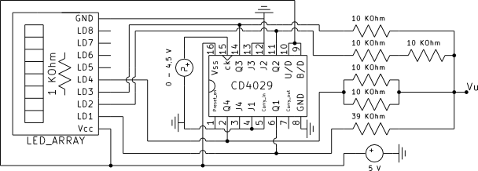
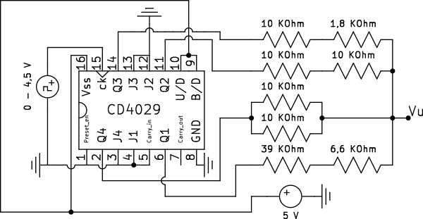
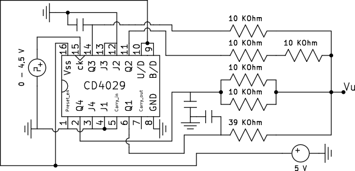
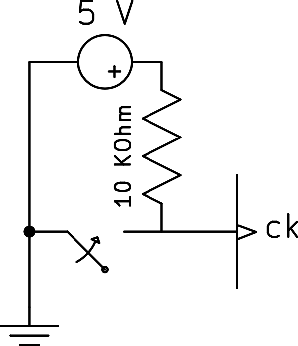
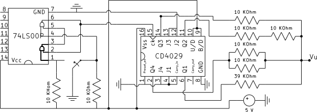
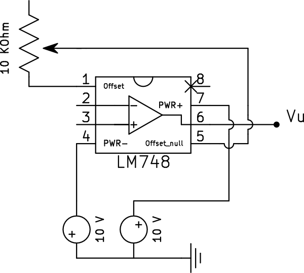
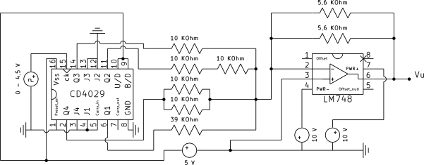
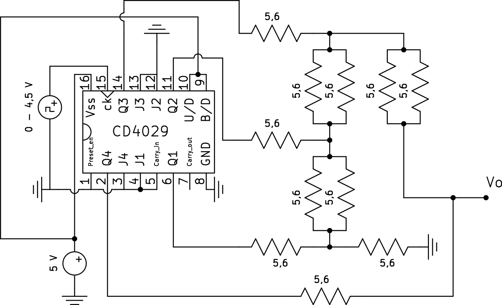
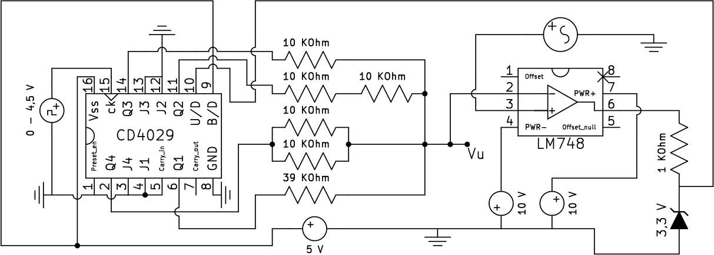

### RELAZIONE DI LABORATORIO – ELETTRONICA
#### ESERCITAZIONE 3 – CONVERTITORE D/A E A/D CON RETE DI PESO 
**(Giovedì 21 Novembre 2013)**

SQUADRA A06  – LED 9

-	**Elenco dei dispositivi:**
	
o	Oscilloscopio Digitale Agilent DSO3102A 

o	Cavi coassiali (BNC-BNC)

o	Cavi banana-banana

o	Sonde compensate Agilent N2862A

o	Resistenze

o	Condensatori

o	Piastra per montaggi sperimentale 

o	Generatore di funzioni Agilent 33220A

o	Contatore asincrono CD4029

o	Amplificatore operazionale (LM748, LM741)

o	Schedina di LED con resistenza

o	Multimetro digitale da banco Agilent 34401A

o	Porte logiche NAND (74LS00)

-	**Scopo dell’esercitazione**

o Verificare il funzionamento di un convertitore D/A a 4 bit

o Individuare i punti critici per la nonlinearità differenziale e per i glitch

o Verificare il funzionamento di un convertitore D/A a 4 bit con rete di resistenze a scala 

o Verificare il funzionamento di un convertitore A/D a inseguimento

Determinando man mano gli errori di guadagno, offset, non linearità.

-	**Cenni di teoria**

Il convertitore digitale analogico è un componente elettronico in grado di ricevere all’ingresso una grandezza numerica e di produrre in uscita una grandezza analogica (generalmente tensione o corrente), in funzione del valore presentato all’ingresso.   
Nel funzionamento del convertitore si possono descrivere due diversi comportamenti: un primo statico, cioè a transitorio esaurito, ed un secondo dinamico definito in fase di transizione tra i due livelli dell’uscita. 
E’ possibile definire una serie di errori, dovuti al fatto che D (grandezza in ingresso) assume solamente un numero finito di valori; ciò infatti va a definire una funzione di trasferimento formata da un insieme discreto di punti, la cui distanza è di 1 unità, cioè 1 LSB sull’asse numerico.
In condizioni di idealità tutti i punti della caratteristica dovrebbero essere equispaziati ed allineati su di una retta passante per l’origine, con pendenza data dal rapporto dei due sfondi scala. Tuttavia, a causa dell’errore di conversione, i punti sono spostati sull’asse delle ordinate e dunque si rende necessario usare una curva interpolante tutti i punti. Dal momento che la nuova curva sarà differente dalla retta originale dobbiamo andare a classificare lo scostamento tra le due. Gli errori possono essere classificati in statici e dinamici.
Gli errori statici possono essere a loro volta lineari o non lineari. Tra i primi troviamo l’offset, che consiste in una traslazione della retta ideale di un certo coefficiente (indifferentemente considerabile sull’asse delle ascisse e quello delle ordinate), ed un errore di guadagno, che definisce la variazione di pendenza rispetto alla funzione di trasferimento ideale. Questi errori possono essere compensati, mentre l’errore di non linearità non può essere recuperato in alcun modo. Anche questi ultimi possono essere a loro volta di due tipi: integrale e differenziale. Si definisce non linearità integrale lo scostamento massimo della retta reale rispetto alla migliore curva approssimante. Inoltre in condizione di idealità ci aspetteremmo che i punti siano spaziati di 1 LSB sull’asse numerico e di Ad sull’asse analogico; in realtà questi Ad saranno tutti diversi tra loro e proprio la differenza tra l’Ad ideale e quello reale è la definizione di non linearità differenziale, che va a definire quindi il comportamento locale della caratteristica. Una non linearità differenziale maggiore di +-1/2 LSB determina un’inversione di pendenza ed è particolarmente dannosa perché determina il salto di codici. Se gli errori di non linearità differenziali sono minori di 1 LSB, il D/A è definito monotono.
In funzionamento dinamico si possono inoltre definire: il tempo di assetto, ovvero il ritardo tra il momento in cui viene applicata la variazione dell’ingresso al momento in cui l’uscita rientra nella fascia di regime e il glitch. In transitorio, a causa della differenza dei diversi tempi di propagazione nella logica di controllo e soprattutto a causa dei diversi tempi di azionamento degli interruttori, il cambiamento non è contemporaneo su tutti i bit. Si verifica una brusca variazione dell’uscita che è detta glitch.  I punti in cui possono verificarsi dei glitch sono quelli in cui la variazione di 1 LSB comporta la commutazione di più bit del codice (quindi S/2, S/4, S/8 ecc). Per ridurne l’effetto si usano principalmente due tecniche: la prima consiste nel campionare l’uscita del D/A a transitorio esaurito, la seconda nel limitare lo slew rate dell’uscita.
Si definisce, infine, convertitore A/D un componente elettronico che riceve in ingresso una grandezza analogica e trasmette in uscita una grandezza numerica a valori discreti. Nel caso di A/D ad inseguimento la logica di controllo che genera i valori D è un contatore, controllato da un comparatore posto all’ingresso. Il tutto forma un sistema con reazione negativa, che tende a rendere minimo il segnale di errore tra la grandezza che approssima il segnale in ingresso (A’) e la grandezza stessa (A). Il segnale A’ varia a passi di 1 LSB, finchè il segno è costante, A’ ha un andamento a gradinata. Se lo slew rate di A inferiore alla velocità di variazione dell’uscita del D\A, A’ insegue A con un errore sempre inferiori di 1 LSB. Nel caso quest’ultima condizione non sia rispettata si parla di sovraccarico (overload).  

-	**DIARIO DELL’ESPERIENZA**

o *VERIFICARE IL FUNZIONAMENTO DI UN CONVERTITORE D/A A 4 BIT*

Innanzitutto abbiamo alimentato il CD4029, quindi collegato a terra gli ingressi non utilizzati e ad alimentazione i piedini di up/down e bin/dec. Abbiamo dunque applicato, dopo i dovuti controlli con il muiltimetro, il segnale di clock, verificando con l'oscilloscopio prima che le frequenze di commutazione delle singole uscite fossero proporzionali alla frequenza dello strumento (in particolare la frequenza su ogni bit era la matà di quello precedente). 

Abbiamo poi montato il contatore come specificato, costruendo le resistenze da 20 k&Omega; e da 5 k&Omega; con due resistenze da 10 k&Omega; in serie ed in parallelo rispettivamente.

(schema 1)  

Il segnale visualizzato al terminale di uscita del convertitore (Vu) è una gradinata di 16 livelli equispaziati, come ci aspettavamo.

(foto 1)

Con i cursori dell'oscilloscopio, abbiamo misurato il fondo scala ed il valore del LSB che ci risultavano essere rispettivamente 5,04 V e 352 mV. In seguito, collegando la basetta di LED, abbiamo notato una riduzione dell'intervallo da 5,04 V a 3,12 V e l'introduzione di un errore di offset di 1,92 V. Di conseguenza anche il LSB risulta minore (220 mV).

(schema 2) 

Questo comportamento è dovuto alla resistenza del CMOS, la quale fa in modo che il voltaggio si ripartisca tra questa e la resistenza da 1 k&Omega; presente sulla basetta, incrementando così il livello dello stato low. Per eliminare questo effetto sarebbe sufficiente aumentare la resistenza tra diodo ed alimentazione. 

(foto 2)

Abbiamo inserito in serie a R1 una resistenza da 6,6 k&Omega; (circa il 15% della prima) ed abbiamo verificato che gli scalini dei bit corrispondenti ai valori dispari si erano rimpiccioliti. Ripetendo l'esperienza con R3 (questa volta con una resistenza da 1,8 k&Omega;) abbiamo notato che a variare era invece un bit ogni quattro, seccondo quello che ci aspettavamo. 

(foto 3) (schema 3) 

o *INDIVIDUARE I PUNTI CRITICI PER LA NON LINEARITA' DIFFERENZIALE E PER I GLITCH*

Per ottenere una non monotonicità, abbiamo calcolato il valore della resistenza da mettere in serie a R4:
 
(formula 1)

Abbiamo, quindi, inserito una resistenza di 3 kΩ ottenendo (foto 4)

Per eseguire questo punto, abbiamo collegato tre condensatori da 0,5 nF in parallelo a Q1, Q3, Q4, verificando successivamente, con l'oscilloscopio, la presenza di glitch.

Il condensatore su Q1 dovrebbe generare dei glitch in corrispondenza di ogni scalino (uno verso l'alto ed uno verso il basso, alternativamente) che però non sono visibili perchè troppo piccoli. La presenza del carico capacitivo si può notare comunque perchè gli scalini risultano un po' più "smussati". L'effetto degli altri due condensatori è invece più facilmente visibile in corrispondenza delle variazioni L -> H ed H -> L del MSB e del MSB-1.

(foto 5) (schema 4)  

Riducendo di molto la frequenza del clock (0,5 Hz), abbiamo verificato con il multimetro che gli scalini sono equispaziati e che l'intervallo tra gradini adiacenti corrisponde ad un LSB. Collegando i LED, i gradini risultano ancora equispaziati, ma la tensione minima risulta 1,92 V, mentre quella massima rimane sostanzialmente invariata; a causa di questo restringimento dell'intervallo, la differenza tra due scalini adiacenti risulta minore (circa 220 mV). (vedere schema 2)

Abbiamo costruito un interruttore manuale utilizzando un filo volante collegato a massa ed una resistenza di pull-up collegata al generatore.

(schema 5) 

Questo interruttore, però, risultava instabile in quanto ad ogni commutazione generava dei rimbalzi che visualizzavamo sullo schermo dell'oscilloscopio come un numero imprevedibile di impulsi. Per evitare questo comportamento abbiamo usato il componente 74LS00 montato come circuito antirimbalzo.

(schema 6) 

Dovendo ottenere un fondo scala di -5 V, abbiamo iniziato a montare l'amplificatore di transresistenza (LM748). Dopo averlo alimentato, sotto consiglio dell'esercitatore, abbiamo collegato il piedino di offset a quello di offset_null tramite un potenziometro, agendo su di esso per regolare la compensazione dell'offset: purtroppo non c'è stato un risultato apprezzabile.

(foto 6) (schema 7) 

Una volta svolti i calcoli per ricavare il corretto valore di R5 (vincolato al valore di fondo scala dato), abbiamo trovato che la resistenza di reazione deve essere di 2,66 k&Omega; , che abbiamo approssimato con due resistenze in parallelo da 5,6 k&Omega; ciascuna. Montando quindi il circuito il risultato non è stato, inizialmente, quello sperato. Con l'aiuto dell'esercitatore abbiamo scoperto che il malfunzionamento era causato da alcuni fili che non facevano contatto correttamente.

(foto 7) (foto 8)

(schema 8)

o *VERIFICARE IL FUNZIONAMENTODI UN CONVERTITORE D/A A 4 BIT CON RETE DI RESISTENZE A SCALA*

Per costruire la rete di resistenze a scala, abbiamo preso come riferimento R in modo che la resistenza di uscita del contatore rimanesse invariata.

(formula 2) R = R1||R2||R3||R4 = 2,66 k&Omega;

Per ottenere R abbiamo utilizzato due resistenze da 5,6 k&Omega; in parallelo, mentre per ottenere 2R abbiamo semplicemente utilizzato una da 5,6 k&Omega;. Dopo aver montato la rete a scala come si può vedere nella figura ? 

(schema 9) (foto 9) 

abbiamo visualizzato sull'oscilloscopio il segnale a gradinata.

(foto 10)

Dopodichè, utilizzando i cursori, abbiamo misurato il fondo scala  ed il LSB che risultavano essere 4,84 V e 340 mV rispettivamente. 

o *VERIFICARE IL FUNZIONAMENTO DI UN CONVERTITORE A/D A INSEGUIMENTO*

Per montare il cicuito ad inseguimento, abbiamo rimosso la resistenza di reazione e ne abbiamo posta una da 1 k&Omega; all'uscita dell'amplificatore, collegata successivamente al piedino up/down del contatore e ad un diodo Zener (da 3,3 V) posto a massa. 

(schema 10)  

Abbiamo quindi impostato il secondo generatore di segnali (piuttosto datato) presente sul banco per generare un'onda sinusoidale di 20 Hz, tuttavia controllando il segnale di uscita mediante l'oscilloscopio, ci siamo accorti che non era corretto: non era possibile modificare la componente continua ed il segnale risultava notevolmente disturbato.
Abbiamo di conseguenza deciso di usare come segnale di clock quello generato dall'oscilloscopio stesso (1 kHz e duty cycle 50%) e di utilizzare il generatore di segnali digitale (funzionante) per l'onda sinusoidale. Collegando questo segnale al morsetto non invertente del LM748, abbiamo ottenuto il risultato cercato, cioè abbiamo visualizzato l'onda a gradinata che seguiva l'andamento dell'onda sinusoidale posta sul morsetto non invertente.

(foto 11) (foto 12) (foto 13)

-	**Commenti**

Questa esperienza è stata indubbiamente la più impegnativa delle tre svolte, soprattutto per il numero ingente di richieste da eseguire in sole tre ore. Abbiamo avuto qualche problema nello svolgimento del punto 11, per via di un malfunzionamento degli amplificatori, che però alla fine siamo fortunatamente riusciti a risolvere. Anche nello svolgimento dell'ultimo punto purtroppo, però, abbiamo riscontrato dei problemi. Riuscivamo a costruire il circuito correttamente, ma inspiegabilmente non riuscivamo a visualizzare sull’oscilloscopio la forma d’onda che ci aspettavamo. Cambiando poi il generatore di segnali siamo riusciti ad aggirare il problema, ma per portare a termine l’esperienza ci siamo visti costretti a fermarci oltre l’orario dovuto, grazie alla disponibilità dell’esercitatore.
Nonostante tutto, ci siamo ritenuti abbastanza soddisfatti del lavoro.

